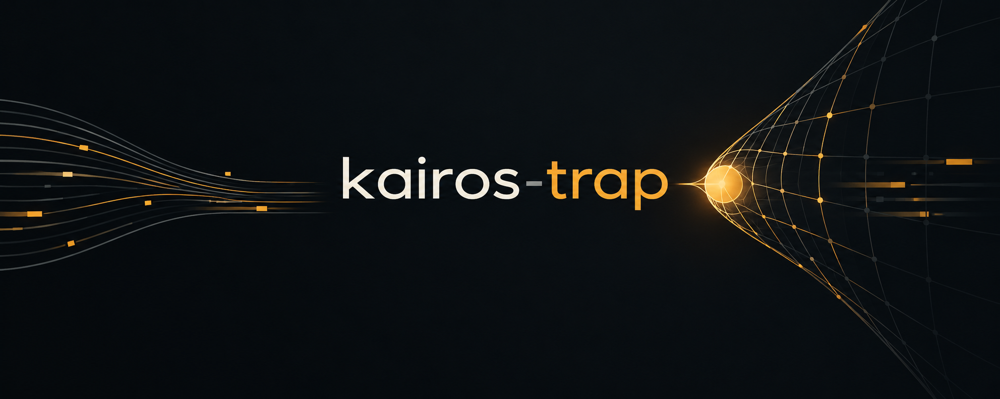

<p align="center">
  
</p>

# **kairos-trap**


### Visão geral

O kairos-trap coleta, transforma e organiza dados públicos do mercado financeiro brasileiro, principalmente de CVM e B3, por meio de pipelines de ETL independentes. O projeto fornece infraestrutura compartilhada para extração, transformação, validação, checkpoints, retenção e armazenamento dos dados, além de componentes para análise exploratória, pesquisa financeira e aplicações Streamlit. Cada pipeline possui regras próprias de origem, formato e processamento, mas segue convenções comuns de execução e organização.

---

# **Pipelines**

A camada de pipelines é responsável pela aquisição, preparação e persistência dos dados.

### Processos ETL

| Processo | Descrição |
|---|---|
| `extract` | Aquisição dos dados de origem e armazenamento dos arquivos brutos. |
| `to_interim` | Padronização inicial dos dados e organização em uma camada intermediária. |
| `to_processed` | Transformação e consolidação dos dados para a camada processada. |
| `load` | Persistência dos dados no destino configurado do pipeline. |
| `compare` | Comparação entre snapshots para identificar alterações e diferenças. |
| `retention` | Aplicação da política de retenção de dados e logs do projeto. |

### Pipelines disponíveis

| Pipeline | Fonte dos dados | Descrição |
| ------------------------------------------------------- | ------------------------------------------------------------------------------------------------- | ------------------------------------------------------------------------------------------------ |
| `cvm_formulario_informacoes_trimestrais`                | [CVM](https://dados.cvm.gov.br/dados/CIA_ABERTA/DOC/ITR/DADOS/)                                   | Extração e processamento dos dados do formulário ITR.                                            |
| `cvm_formulario_demonstracoes_financeiras_padronizadas` | [CVM](https://dados.cvm.gov.br/dados/CIA_ABERTA/DOC/DFP/DADOS/)                                   | Extração e processamento dos dados do formulário DFP.                                            |
| `cvm_cias_abertas_informacao_cadastral`                 | [CVM](https://dados.cvm.gov.br/dataset/cia_aberta-cad)                                            | Extração e processamento das informações cadastrais de companhias abertas.                       |
| `cvm_formulario_de_referencia`                          | [CVM](https://dados.cvm.gov.br/dados/CIA_ABERTA/DOC/FRE/DADOS/)                                   | Extração e processamento dos dados do formulário FRE.                                            |
| `cvm_informacoes_periodicas_e_eventuais` — *dev*        | [CVM](https://dados.cvm.gov.br/dados/CIA_ABERTA/DOC/IPE/DADOS/)                                   | Extração e processamento das informações periódicas e eventuais divulgadas pelas companhias.     |
| `cvm_formulario_cadastral` — *dev*                      | [CVM](https://dados.cvm.gov.br/dados/CIA_ABERTA/DOC/FCA/DADOS/)                                   | Extração e processamento dos dados do formulário FCA.                                            |
| `cvm_valores_mobiliarios_ofertados` — *dev*             | [CVM](https://dados.cvm.gov.br/dados/CIA_ABERTA/DOC/VLMO/DADOS/)                                  | Extração e processamento dos dados de valores mobiliários ofertados.                             |
| `google_noticias_mercado` — *dev*                       | [Google](https://news.google.com/)                                                           | Extração e processamento de notícias relacionadas ao mercado financeiro.                         |
| `b3_enriquecimento_cadastral_ativos` | [B3](https://www.b3.com.br/)                                                           | Extração e processamento de informações complementares para enriquecimento cadastral e identificação de ativos financeiros. |
| `b3_indices_segmentos_setoriais`               | [B3](https://www.b3.com.br/pt_br/market-data-e-indices/indices/indices-de-segmentos-e-setoriais/) | Extração e processamento da composição dos índices de segmentos e setoriais.                     |
| `social_monitoramento_agentes_de_mercado` — dev | [Redes sociais]() | Monitoramento e processamento de publicações de agentes de mercado em redes sociais.

---

# **Research**

A camada de Research é responsável pelo consumo e utilização dos dados produzidos pelos pipelines.

| Componente | Descrição |
|---|---|
| `research/` | Exploração e análise dos dados gerados pelos pipelines. |
| `streamlit_apps/` | Consumo e visualização dos dados em interface analítica. |

### Apps disponíveis

| App | Descrição | Preview |
|---|---|---|
| `streamlit_app_pipelines` | Monitoramento operacional dos pipelines ETL, incluindo:<br>• Consulta de pipelines disponíveis<br>• Logs de execução<br>• Checkpoints organizados por pipeline, stage e step | [preview](docs/streamlit_apps/preview/streamlit_app_pipelines/page_overview.png) |
| `streamlit_app_research` | Aplicação analítica para pesquisa de mercado, incluindo:<br>• Monitoramento geral e setorial<br>• Acompanhamento de preços, retornos e balanço<br>• Avaliação de estratégias de investimento<br>• Análise de conjuntos de ativos<br>• Consulta de notícias por ativo<br>• Configuração de alertas | [preview](docs/streamlit_apps/preview/streamlit_app_research/asset_explorer.pdf) |

---

# **Data Providers**

A camada de **Data Providers** é responsável pela integração com ``bibliotecas`` e APIs externas de dados de mercado, encapsulando requisições, tratamento, validação e normalização das respostas antes de disponibilizá-las ao restante do projeto.

| Componente                   | Descrição                                                                                         |
| ---------------------------- | ------------------------------------------------------------------------------------------------- |
| `yfinance_price_provider.py` | Integração com o yfinance para obtenção, validação, tratamento e normalização de dados de preços. |

---

# **Como utilizar**

### 1. Clonar o projeto

```python
git clone https://github.com/rianlucascs/kairos-trap
cd kairos-trap
```

### 2. Instalar dependências

```bash
pip install -e .
```

### 3. Executar um pipeline manualmente

Cada pipeline é dividido em stages, e cada stage possui seu próprio `pipeline.py`. Para executar um stage isoladamente:

```bash
python pipelines/<nome_do_pipeline>/stage/pipeline.py
```

Exemplo:

```bash
python pipelines/cvm_formulario_informacoes_trimestrais/extract/pipeline.py
```

### 4. Agendar execuções no servidor

Para rodar os pipelines automaticamente via `systemd timers`, siga o passo a passo em [`docs`](docs).

### 5. Consumir os dados

Utilize os apps em `streamlit_apps` para monitorar pipelines e explorar os dados processados, ou acesse diretamente via `research`.

---

# **Topologia**

| Componente | Detalhe |
|---|---|
| OS | Ubuntu Server LTS |
| Acesso remoto | OpenSSH + VS Code Remote-SSH |
| Execução | Docker e Docker Compose |
| Armazenamento compartilhado | Samba — `/srv/data` |
| Agendamento | systemd timers |
